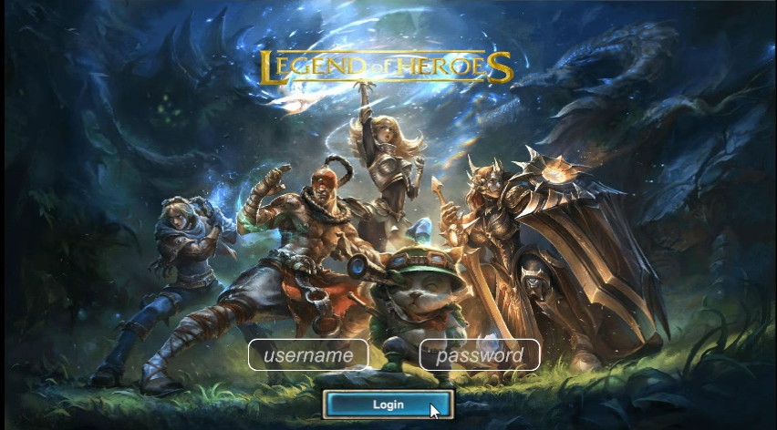
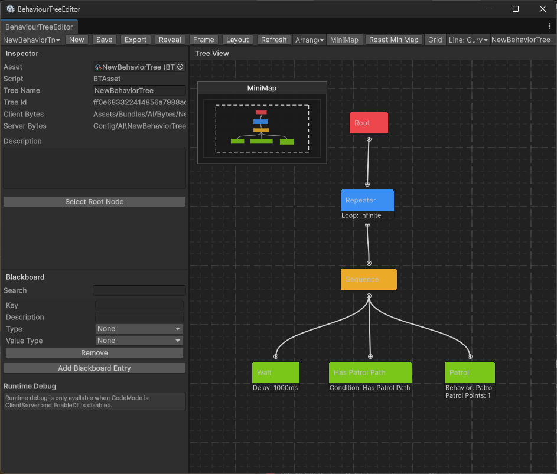

<div align="center">
  <h2 href="https://github.com/FlameskyDexive/Legends-Of-Heroes">
    <!--  -->
  </h2>
  <h2 align="center">
    Legends-Of-Heroes
  </h2>
  <p><em>A production-ready open-source multiplayer game framework built with ET 8.x, Unity 2022.3, and .NET 10.</em></p>
    
    
    
    
    
</div>

**English** | [简体中文](./README.zh-CN.md)

This project is a front-end and back-end game framework built on the [ET framework](https://github.com/egametang/ET). It ships a basic hot-update pipeline and a relatively complete combat system (an ECS-based skill + Buff system is already in place; the skill editor / behavior-tree editor are still under development). [Legends-Of-Heroes](https://github.com/FlameskyDexive/Legends-Of-Heroes) uses **state synchronization**: all collision detection, skill, and AI logic runs on the server.

<a href="./Document/loh.mp4"></a>

> 📺 **Click the image above to watch the demo video.** The raw MP4 lives at [`Document/loh.mp4`](./Document/loh.mp4) — GitHub renders it as an inline player when you open the file directly.

---

## 📐 Architecture Diagram

Legends-Of-Heroes is layered as a classic ET-style **ECS + Actor** architecture. The diagram below shows the relationship between the server process, the Unity client, the shared `Model` / `Hotfix` assemblies, and the third-party ecosystem that plugs into them.

```
                         ┌─────────────────────────────────────────────┐
                         │                   CLIENT                     │
                         │            Unity 2022.3.62f3                 │
                         │  ┌─────────────────────────────────────────┐ │
                         │  │  UI Layer: EUI (UGUI) / YIUI            │ │
                         │  │  Joystick · Camera Follow · Debugger    │ │
                         │  ├─────────────────────────────────────────┤ │
                         │  │  HybridCLR (hot-update)                 │ │
                         │  │  YooAsset 3.0 (assets / bundles)        │ │
                         │  ├─────────────────────────────────────────┤ │
                         │  │  ModelView  ·  HotfixView  (client ECS) │ │
                         │  └───────────────────┬─────────────────────┘ │
                         └──────────────────────┼──────────────────────┘
                                                │  TCP / KCP / WebSocket
                                                │  state-sync + position broadcast
                         ┌──────────────────────┼──────────────────────┐
                         │                      ▼                       │
                         │                 SERVER PROCESS                │
                         │                  .NET 10                      │
                         │  ┌─────────────────────────────────────────┐ │
                         │  │  Actor Location · Message Routing        │ │
                         │  │  (login · lobby · room · map)            │ │
                         │  ├─────────────────────────────────────────┤ │
                         │  │  Gameplay ECS                            │ │
                         │  │  Skill · Buff · Timeline · Collision     │ │
                         │  │  Behavior Tree · AOI · Move · Lockstep   │ │
                         │  ├─────────────────────────────────────────┤ │
                         │  │  Model  ·  Hotfix  (server ECS)          │ │
                         │  ├─────────────────────────────────────────┤ │
                         │  │  DB · Redis · Config (Luban)             │ │
                         │  └─────────────────────────────────────────┘ │
                         └─────────────────────────────────────────────┘
                              ▲                                   ▲
                              │                                   │
                ┌─────────────┴──────────┐          ┌─────────────┴────────────┐
                │   SHARED ASSEMBLIES    │          │    TOOLING / AI WORKFLOW │
                │  cn.etetet.* packages  │          │  AIBridge CLI · UnityMCP │
                │  (Model / Hotfix)      │          │  AI Agents (pluggable)   │
                └────────────────────────┘          └──────────────────────────┘
```

### Layer Overview

| Layer | Responsibility | Key Packages |
|-------|----------------|--------------|
| **Server (`.NET 10`)** | Game logic, AI, collision, networking, persistence | `core`, `actorlocation`, `netinner`, `statesync`, `skill`, `spell`, `behaviortree`, `collision`, `aoi`, `db` |
| **Client (`Unity 2022.3`)** | Rendering, input, UI, local prediction | `eui`, `yiui*`, `hybridclr`, `yooassets`, `move` |
| **Shared `Model` / `Hotfix`** | ECS components, systems, hot-updatable logic | All `cn.etetet.*` packages |
| **Tooling** | Build, codegen, AI-assisted development | `harness`, `unitybridge`, AIBridge CLI, UnityMCP |

> The full module list lives under [`Packages/`](./Packages) (70+ `cn.etetet.*` packages). Each package follows ET's `Model` / `ModelView` / `Hotfix` / `HotfixView` assembly split for hot reload.

---

## ✨ Features

### 🌐 Networking
- **State synchronization** — all authoritative gameplay logic runs server-side; clients render broadcasted state.
- **Actor model messaging** — `actorlocation` + `netinner` provide location-transparent RPC and message routing across processes.
- **Multi-protocol transport** — TCP / KCP / WebSocket supported by the ET networking layer.
- **Reconnect & session** — basic disconnect-reconnect and return-to-login flow.
- **Distributed ready** — `servicediscovery` + `router` for multi-process topologies (managed via .NET Aspire).

### 🤖 AI Agents
- Pluggable AI workflow hooks for AI-assisted development (see `Packages/cn.etetet.harness/`).
- Designed to integrate with external AI agents / MCP-compatible tooling for codegen, debugging, and content authoring.

### 🌳 Behavior Tree
- In-engine **behavior tree editor** for authoring NPC / enemy AI.
- Node library exposed via the `btree` / `btnode` / `btreedemo` packages.



### ⚔️ Skill System
- ECS-based skill framework supporting **active & passive** abilities.
- Server-authoritative casting, targeting, and cooldowns.
- A demo active skill is wired into the Ball Battle demo.

### 💥 Buff System
- Composable buff/effect pipeline integrated with the skill and timeline systems.
- Stack rules, duration management, and modifier application all server-side.

### 📊 Luban
- Configuration powered by [Luban](https://github.com/focus-creative-games/luban) — multi-platform, type-safe, code-generated configs.
- Workflow integrated into the `harness` build pipeline (`et-luban` / `et-excel`).

### 📦 YooAsset
- Asset bundling, loading, and hot-update via [YooAsset 3.0](https://github.com/tuyoogame/YooAsset).
- Combined with HybridCLR for full code + asset hot-update.

### 🔌 UnityMCP
- MCP-compatible bridge for editor automation (compile, refresh, log retrieval, prefab/scene ops).
- See [`AGENTS.md`](./AGENTS.md) for the AIBridge / UnityMCP / UnityBridge channel priority.

### 🎮 More
- **HybridCLR** — C# hot-update with check & download flow.
- **Box2DSharp** — 2D physics / bullet collision.
- **EUI / YIUI** — UGUI frameworks adapted for ET.
- **AOI** — interest management for large worlds.
- **Lockstep / TrueSync** — deterministic sync primitives.
- **One-click build** — menu `ET/Build/...`, tested on Win/Android.

---

## 🗺️ Roadmap

| Status | Item |
|:------:|------|
| 🚧 | **Timeline skill editor** integrated with the combat system |
| ✅ | Behavior tree editor + combat (behavior tree shipped) |
| 🚧 | **Game lobby & matchmaking** — up to 20 players per room |
| ✅ | Skill framework (active/passive) + Buff system |
| ✅ | Timeline skill event system |
| ✅ | Bullet collision system (Box2DSharp) |
| ✅ | HybridCLR + YooAsset hot-update pipeline |
| ✅ | One-click build (Win/Android) |
| 🚧 | **2D MOBA mode** (stretch goal) |
| 🔜 | More per-module video walkthroughs |

Legend: ✅ shipped · 🚧 in progress / planned · 🔜 future

---

## 📋 Requirements

- **Unity**: 2022.3.62f3
- **IDE**: Visual Studio 2022 or Rider 2023
- **.NET SDK**: 10.0
- **OS**: Windows (primary); some tooling may not run on macOS/Linux.

## 🚀 Quick Start

1. **Clone**
   ```bash
   git clone https://github.com/FlameskyDexive/Legends-Of-Heroes.git
   cd Legends-Of-Heroes
   ```
2. **Open** the project in Unity 2022.3.62f3 and let it import.
3. **Follow** the run guide under the [`Book/`](./Book) directory (`1.1Running Guide.md`).

> GitHub slow or blocked in your region? Mirror available on Gitee: [Legends-Of-Heroes](https://gitee.com/flamesky/Legends-Of-Heroes).

---

## 🤝 Contributing

Contributions are welcome — bug reports, feature ideas, docs, and PRs are all appreciated. Please read [CONTRIBUTING.md](./CONTRIBUTING.md) before opening a pull request.

Quick links: [open issues](https://github.com/FlameskyDexive/Legends-Of-Heroes/issues) · [CONTRIBUTING.md](./CONTRIBUTING.md) · [Code of Conduct](./CONTRIBUTING.md#code-of-conduct)

If you find the project useful, a ⭐ in the top-right corner goes a long way!

---

## 📺 Video Walkthrough

A single demo video has been recorded so far — [Hands-on / Build & Matchmaking](https://www.bilibili.com/video/BV1sP6fY2EQU/). More videos covering the design rationale and usage of each module will follow.

---

## 🙏 Special Thanks

Thanks to JetBrains for providing licenses!

<p><a href="https://www.jetbrains.com/?from=Legends-Of-Heroes">
</a></p>

## 🔗 Friends & Credits
### [Fantasy](https://github.com/qq362946/Fantasy) — A high-performance .NET networking framework supporting mainstream protocols, with separated front-end and back-end.
### [UniJoystick](https://github.com/Bian-Sh/UniJoystick) — A universal UGUI-based joystick component.
### [X-ET7](https://github.com/IcePower/X-ET7) — A fork of ET7 integrating FGUI + YooAsset + Luban.
### [NKGMobaBasedOnET](https://github.com/wqaetly/NKGMobaBasedOnET) — Yanyu's open-source MOBA case, heavily modified from ET5.X.
### [XAsset](https://github.com/xasset/xasset) — A highly efficient, easy-to-use, and powerful asset management system (build / load / hot-update).
### [ETPro](https://github.com/526077247/ETPro) — An enhanced ET based on ET6.0, shipping its own skill system, UI framework, and seamless large-world mirroring.

---

## 📄 License

This project is licensed under the [MIT License](./LICENSE).

## ⭐ Star History


